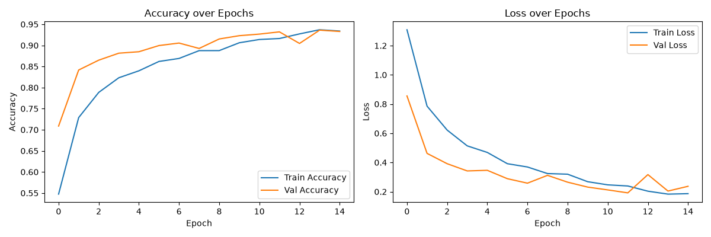
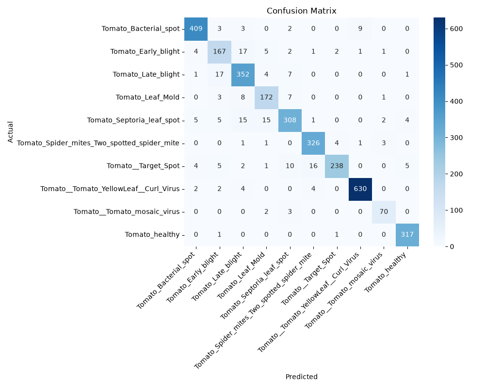

# Tomato Leaf Disease Classifier

A Convolutional Neural Network (CNN) built with TensorFlow/Keras that classifies tomato leaf images into 10 categories (1 healthy + 9 diseases), trained on the PlantVillage dataset.

## Motivation
With a background in Horticulture/Plant Science (M.Sc., research in floriculture and postharvest quality), I wanted to combine domain knowledge of plant health with computer vision — applying deep learning to a real, practical agricultural problem where early disease detection can help prevent crop loss.

## Dataset
- **Source:** PlantVillage (tomato subset)
- **Size:** ~16,000 images across 10 classes
- **Split:** 80% train / 20% validation

## Model
- Custom CNN: 3 convolutional blocks (32 → 64 → 128 filters) + dense classifier with dropout
- Framework: TensorFlow/Keras
- Input size: 128x128 RGB images
- Trained from scratch (no transfer learning)

## Results
- **Validation Accuracy: ~94%**
- Full per-class precision/recall/F1 scores in the notebook
- Strongest classes: Healthy (99% recall), Yellow Leaf Curl Virus (98% precision)
- Weakest class: Early Blight (78% recall) — visually confused with Septoria Leaf Spot and Late Blight, which is agronomically reasonable since all three cause similar dark leaf lesions

## How to Run
1. Clone this repo
2. Install dependencies: `pip install tensorflow scikit-learn seaborn matplotlib pillow`
3. Download the [PlantVillage dataset](https://www.kaggle.com/datasets/emmarex/plantdisease) and place the tomato class folders under `data/PlantVillage/`
4. Open `CODE.ipynb` and run all cells

## Demo
The notebook includes a `predict_image()` function — pass in any tomato leaf image path and it returns the predicted disease class with a confidence score.

## Author
Abdul Rehman — background in Agriculture/Horticulture, transitioning into AI/ML.